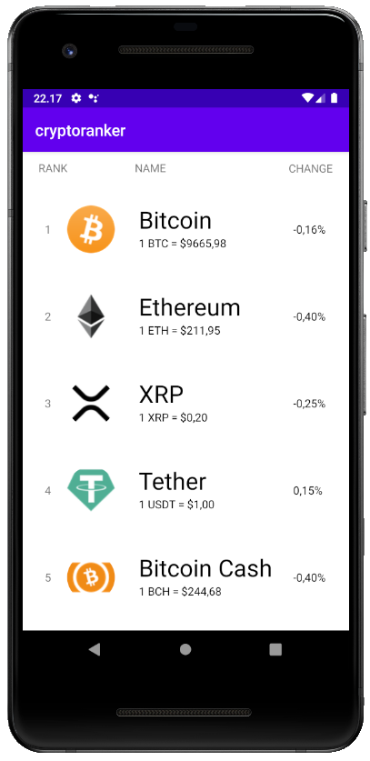
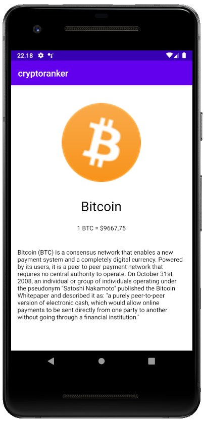

# Cryptoranker
[](https://www.android.com)

:iphone: Android app which displays top 50 currencies with live data.

 

Cryptoranker is an Android app that lists top 50 of cryptocurrencies.
This list includes prices in USD, logos and 24 hours changes in percentage.

## Features

* Displays A list with asset name, price, latest 24 hours percent change and asset logo for the top 50 cryptos
* Comes with a content provider so Crypto data can be used in other apps through the provided ContentProvider
* Uses fragtments to provide single views for phones and a two pane view for tablets for each crypto with logo,
  crypto description and price.

## How to test the ContentProvider(CryptoProvider)?
To test the ContentProvider or so called CryptoProvider you will have to change the activity in the `AndroidManifest.xml`.
You'll have to replace the following activity:
```
<activity android:name=".MainActivity">
```
With the TestContentProviderActivity
```
<activity android:name=".TestContentProviderActivity">
```
When you then rebuild and run the app you will get a recycleview with the 50 cryptocurrencies from the database which is provided by the CryptoProvider.

## Libraries used

* <a href="https://developer.android.com/topic/libraries/architecture/room">Room</a>: Library used for easier database access and as abstraction layer on top of SQlite.
* <a href="https://github.com/square/retrofit">Retrofit2</a>: Library used to retrieve JSON from Coinmarketcap API via a REST based webservice.
* <a href="https://github.com/bumptech/glide">Glide</a>: Library used for loading and caching images and display them. Primarily the logos.
* <a href="https://github.com/hdodenhof/CircleImageView">CircleImageView</a>: Library used for creating round images for the crypto logos.
* <a href="https://github.com/google/gson">GSON</a>: Library used to serialize JSON response from the REST API into Java objects.

## Permissions

`android.permission.INTERNET`

This is required for internet connection so we can get data for the Coinmarketcap REST API.

## Sources

* <a href="https://coinmarketcap.com/">CoinMarketCap</a>: Provides all the data on the currencies
